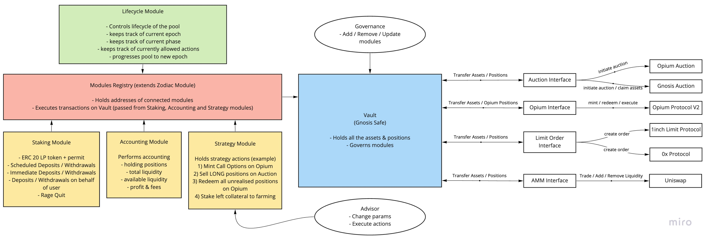

# Opium Pools v2



Opium Pools v2 is a set of decentralized smart contracts that allow to pool together the funds for various actors in a trustless environment. Pooled funds can be used in any arbitrary strategy that fits into pools limitations.

## Audit

Audited in July 2022 by [Pessimistic](./docs/files/OpiumPoolsV2SecurityAnalysisbyPessimistic.pdf) ([original](https://github.com/pessimistic-io/audits/blob/1d724d5e376ab6c987210d31a6d5bac96119dcb9/Opium%20Pools%20Security%20Analysis%20by%20Pessimistic.pdf))

## Documentation

[Read here](./docs/DOCS.md)

## Local Development Setup and initialization

#### Clone repo and install dependencies

The setup assumes that you have:

- Node.js ^14.5
- Yarn

Clone the project and install all dependencies:

```sh
$ git clone git@github.com:OpiumProtocol/opium-pools-v2.git
$ cd opium-pools-v2

# install project dependencies
$ yarn
```
#### Set environment variables

You need to set the environment variable values. Unless you want to deploy the project on a network, the only important value here is Arbitrum network Archive Node RPC URL as it is used to run the tests on the arbitrum fork. Set the following variables on the `.env` file on the root level of the repository:

```sh
touch .env
```

```sh
ARBITRUM_URL=https://eth-ropsten.alchemyapi.io/v2/<YOUR ALCHEMY KEY>
```

## Compile all contracts:

```sh
yarn compile
```

## Run all the tests:

```sh
yarn test
```
