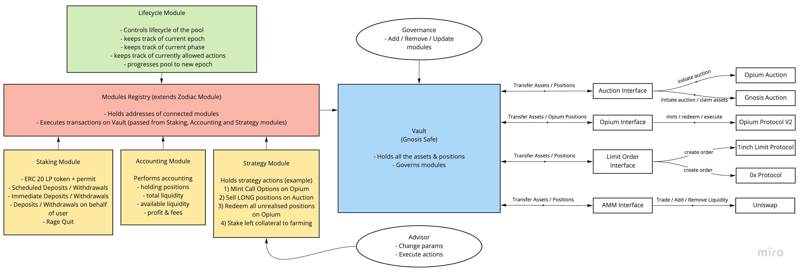

# Intro

Every pool is a set of smart contract communicating with each other and consists of:
- Vault (GnosisSafe)
- Registry Module `*`
- Staking Module `**`
- Accounting Module `**`
- Lifecycle Module
- Strategy Modules `**`

`*` (red color) module that have the right to execute on-chain actions on Vault’s behalf

`**` (yellow color) modules that have the right to execute on-chain actions on Vault’s behalf via Registry Module

(green color) module that doesn’t execute transactions on Vault’s behalf

All modules are deployed via OpenZeppelin’s upgradeability. Registry module can be deployed via the Zodiac Module Proxy Factory.

# Vault

Vault is a core component of the pool and is represented by a pure Gnosis Safe contract.

It’s purpose is:
- To hold all the pool’s assets
- To enable / disable modules that are allowed to execute on-chain actions on Vault’s behalf (e.g. transfer tokens, communicate with external protocols, etc.)
- To govern particular modules as an Owner

# Registry Module

_Registry module is the only contract that does have the right to directly execute any transactions on behalf of the Vault._

Registry is governed by Vault and is used as an address book for the whole pool to keep track of the addresses of the other modules. Registry is used by other modules in a read-only manner to restrict access to particular functions to particular modules. (Read more in description of other modules)

Additionally to address book functionality it inherits [Zodiac Module](https://github.com/gnosis/zodiac) and is the only contract that directly executes transactions on Vault. Other modules execute transactions via the Registry module by sending commands to it.

Read-only functions:
- Get registry addresses (accounting, lifecycle, staking and strategy modules)
- Get Zodiac module’s Avatar and Target

Modifying functions:
- Set registry addresses **(only by Owner)**
- Execute transaction on Vault **(only by Staking, Accounting, Strategy modules)**

# Staking Module

_Staking module has the right to execute any transactions on behalf of the Vault, but only via the Registry module._

Staking module is an ERC20 contract with Permit function. Its main purpose is to represent the pool's shares. Staking module allows users to deposit funds by minting shares in return and withdrawing funds by burning shares.

The staking module is the only interaction point of the end users (stakers).

Besides setting the registry address by Owner, the staking module doesn’t have any additional governance.

Staking module implements [EIP4626](https://eips.ethereum.org/EIPS/eip-4626) Tokenized Vault standard, which aligns its interface with the DeFi ecosystem.

There are only 2 modifiers that check conditions before executing users’ transactions:
- onlyIfCanDeposit - a call to the Lifecycle Module
- onlyIfCanWithdraw - a call to the Lifecycle Module

Interactions with:
- Accounting module to increase / decrease total liquidity on deposits / withdrawals
- Vault to initiate transfer of assets to users on withdrawals

Read-only functions are derived from ERC20 & EIP4626 standards.

Modifying functions are public and are derived from ERC20 & EIP4626 standards:
- Deposit / Mint
- Withdraw / Redeem
- Schedule Deposit / Unschedule Deposit / Claim Shares
- Schedule Withdrawal / Unschedule Withdrawal / Claim Assets
- Rage Quit

## Scheduled Deposits and Withdrawals

In addition to direct deposits and withdrawals, the Staking module provides functionality of so-called “Scheduled Deposits” and “Scheduled Withdrawals”.

Scheduled deposits and withdrawals are only available when direct deposits and withdrawals are not allowed.

Scheduled deposits allow stakers to stake underlying assets anytime, but represented shares only become claimable after the rebalancing is done. Once rebalancing is done, staker can claim its shares anytime. If there is a pending scheduled deposit, staker can “unschedule” some assets and prevent them from being staked after the rebalancing.

The same approach for scheduled withdrawals. Scheduled withdrawals allow stakers to start the withdrawals of assets anytime by locking their shares, but represented assets only become claimable after the rebalancing is done. Once rebalancing is done, staker can claim its assets anytime. If there is a pending scheduled withdrawal, staker can “unschedule” some shares and prevent them from being unstaked after the rebalancing.

After the rebalancing “post rebalancing” hook is triggered by LifecycleModule, which calculates the amount of shares that needs to be burnt / minted and assets that needs to be transferred from / to the Vault and performs these actions if needed.

## Rage Quit

An additional way for stakers to exit the pool is “rage quit”. It allows exiting the pool by burning the shares and immediately withdrawing all the tokenized ERC20 positions that are held by the Vault on a pro-rata basis.

# Accounting Module

_The Accounting module has the right to execute any transactions on behalf of the Vault, but only via the Registry module._

Accounting module performs accounting processes for the pool:
- Tracks total, utilized and available liquidity
- Tracks holding positions (assets) besides the underlying asset
- Accumulates and distributes fees

Read-only functions:
- Get underlying
- Get total liquidity
- Get utilized liquidity
- Get available liquidity
- Get liquidity utilization ratio
- Get accumulated fees
- Get fee receiver address
- Check if has position
- Get immediate profit fee
- Get annual maintenance fee

Modifying functions:
- Change total liquidity **(only by Staking module)**
  - Increment / Decrement total liquidity
- Change holding positions **(only by Strategy module)**
  - Include / exclude positions from the list
- Rebalance **(only by Strategy module)**
  - Checks that Vault doesn’t hold any positions
  - Calculates difference between current Vault’s balance and the one at the epoch beginning
  - If there is a surplus, accumulates profit fee
  - If there is a surplus, accumulates annualized maintenance fee from the AUM
  - Calls **Lifecycle Module** to progress epoch
- Collect fees **(only by Fee collector)**
  - Transfers accumulated fees from Vault to Fee collector
- Set Fee collector **(only by Fee collector or Owner)**
  - Changes Fee collector address
- Set immediate profit fee **(only by Owner)**
- Set annual maintenance fee **(only by Owner)**

Besides modifying functions allows setting the registry address by Vault.

# Lifecycle Module

_Lifecycle module doesn’t have the right to execute any transactions on behalf of the Vault._

Lifecycle module performs lifecycle processes for the pools:
- Tracks current epoch
- Tracks current phase
- Tracks currently allowed actions for other modules
- Progresses pool to the new epoch

Read-only functions:
- Get current epoch start
- Get current epoch end
- Get epoch length
- Get staking phase length
- Get trading phase length
- Check if current phase is STAKING phase
- Check if current phase is TRADING phase
- Check if current phase is IDLE phase
- Check if can deposit now
- Check if can withdraw now
- Check if can trade now
- Check if can rebalance now

Modifying functions:
- Progress epoch (only by Accounting module)
  - Check if can rebalance
  - Set new current epoch start
  - Increments epoch ID
  - Calls Staking Module’s post rebalancing hook

Besides modifying functions allows setting the registry address by Owner.

# Strategy Modules

_Strategy modules have rights to execute any transactions on behalf of the Vault, but only via the Registry module._

There is no restrictions how strategy modules are implemented and what they can do, however they must follow the following rules:
- Whenever a strategy receives or gets rid of any asset (other than an underlying), it must call the Accounting module and indicate it to keep track of holding assets.
- When the strategy has finished manipulations in the current epoch, it must call the Accounting module and indicate it to initiate the Rebalancing process.

Strategies have full access to the Vault’s transaction execution, thus must not be considered as safe.

## Example strategy

- Step 1: Mint LONG + SHORT positions with provided strike price
  - Checks phase (only during TRADING)
  - Asks accounting module for available liquidity
  - Mints LONG + SHORT positions
  - Trigger accounting module
- Step 2: Enable direct positions purchases with provided price
  - Set prices for holding positions
- Step 3: Execute direct positions purchases
  - Checks phase (only during TRADING)
  - Checks provided price
  - Transfers tokens in
  - Transfers positions out
- Step 4: Execute SHORT + unsold LONG positions
  - Checks for redeemable positions
  - Redeems positions
  - Executes the rest of positions
  - Triggers accounting module
- Step 5: Launch new epoch
  - Checks phase (only during IDLE)
  - Triggers accounting module

